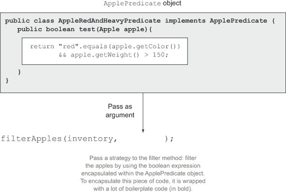
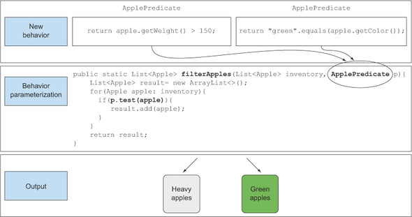

# Ch 2. 동작 파라미터화 코드 전달

Java 8 in Action :: Contents

### 동작 파라미터화 (behavior parameterization)

---

(메서드 내부적으로 다양한 동작을 수행할 수 있도록) **코드를 메서드 인수로 전달한다.**

동작 파라미터화를 이용해 자주 바뀌는 요구사항에 효과적으로 대응할 수 있다.

동작 파라미터화란 아직 어떻게 실행할 것인지 결정하지 않은 코드 블록을 의미한다. 즉 이 코드 블록은 나중에 프로그램에서 호출하므로, 실행이 나중으로 미뤄진다.

동작 파라미터화를 추가하려면 쓸데없는 코드가 추가되는데, 이를 자바8에선 람다 표현식으로 해결한다.

[ 변화하는 요구사항에 대응하는 '농부와 사과' 예제 ]

⇒ 인터페이스와 이들을 구현하는 클래스들을 정의하고 인스턴스화 하며, 변화하는 요구사항에 유연하게 대처하긴 하였으나, 번거롭고 로직과 관련없는 코드가 많이 추가되었다.

'익명클래스'와 '람다'를 이용해 이들을 줄인다.

1. 익명 클래스 (Anonymous Class)

말 그대로 이름이 없는 클래스. 클래스 선언과 인스턴스화를 동시에 할 수 있다.

즉, 즉석에서 필요한 구현을 만들어 사용할 수 있다.

    List<Apple> redApples = filterApples(inventory, new ApplePredicate() {
    			public boolean test(Apple a) {
    				return a.getColor().equals("red"); 
    			}
    });

아쉬운 점 )

- 여전히 불필요한 코드가 남아있다
- MeaningOfThis 예제코드에서 볼수있듯이, 여전히 코드에 복잡성이 존재한다

2. 람다 표현식 (Lambda)

익명 클래스에서 한단계 더 나아가, 람다식으로 더 줄여보면 다음과 같다.

    List<Apple> result = 
    	filterApples(inventory, (Apple apple) -> "red".equals(apple.getColor)));

훨씬 간단하다.

3. [추가단계] 리스트 형식으로 추상화

현재 filterApples는 Apple에 대해서만 동작한다. 이를 Apple외에 바나나, 정수, 문자열 등 다양한 물건에서 필터링하도록 추상화 시킬 수 있다.

(코드 생략)

실전 예제

1. Comparator로 정렬하기
2. Runnable로 코드블록 실행하기
3. GUI 이벤트 처리하기