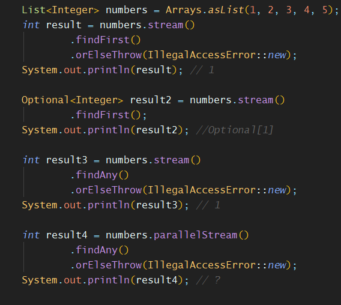

# Ch 5. 스트림 활용

Java 8 in Action :: Contents

### 스트림 연산 종류 (P.148~)

- 책과 'P.166 연산 종류 표'를 참고한다.
- 중간연산들은 파이프라이닝이므로 스트림을, 최종연산들은 각자에 맞는 타입을 반환한다. 특히 일부는 Optional<T>를 반환한다.
- 중간에 flatMap()은 조금 생소했음. 스트림 평면화
- findFirst(), findAny()

