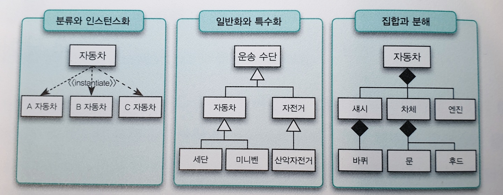

# 객체지향의 사실과 오해

### Chapter Preview

1. 객체지향의 핵심은 클래스나 상속이 아니다
    - 객체지향이란
2. 객체는 상태와 행동, 식별자를 가진 존재
    - 객체란
3. 추상화, 타입
    - 추상화
4. 역할, 책임, 협력
    - 역할/책임/협력
5. 메시지
    - 메시지와 인터페이스
6. 구조는 기능에 비해 변화에 더 안정적
    - 구조는 기능보다 변화에 안정적
7. 전체 정리, 코드
    - 3가지 관점과 커피 전문점 도메인 설계 예제
8. 부록 - 추상화 기법
    - 3가지 추상화 기법

### 기존의 객체지향하면 떠올리는 것들

- SOLID
- 4대 특징
    - 추상화
    - 캡슐화
    - 상속
    - 다형성

---

# CH 1 - 객체지향이란

*객체지향의 오해와 본질*

### 커피 공화국의 아침

- 역할
    - 손님 - 커피 주문 (손님 역할)
    - 캐시어 - 주문 받기 (캐시어 역할)
    - 바리스타 - 커피 제조 (바리스타 역할)
- 책임
    - 손님 - 커피 주문의 책임
    - 캐시어 - 손님의 주문을 받는 책임
    - 바리스타 - 커피를 제조하는 책임
- 협력
    - 모두 '커피 주문'을 위해 협력
- toOOP
    - 사람 → 객체
    - 요청 → 메시지
    - 요청을 처리하는 방법 → 메서드

### 역할, 책임, 협력

- 협력에 참여하는 객체들에게 적절한 역할과 책임을 부여해야 한다
- **객체들은 협력에 참여하기 위해 특정한 역할을 맡고 역할에 적합한 책임을 수행한다**
- 역할이란 단어는 의미적으로 책임의 개념을 내포 → 역할에 적합한 책임을 수행
- 역할은 관련성 높은 책임의 집합
- 어떤 협력에 참여하는지가 객체에 필요한 행동을 결정하고, 필요한 행동이 객체의 상태를 결정한다 (ch4 추가)

- 객체의 덕목
    - 객체는 협력적이어야 한다
    - 객체는 자율적이어야 한다

- 상태와 행동
    - 객체의 자율성은 객체의 내부와 외부를 명확히 구분하는 것으로부터 나온다
    - 객체는 상태와 행위를 하나의 단위로 묶는 자율적인 존재
    - 과거엔 데이터와 프로세스를 엄격히 구분했으나, 현재의 객체지향은 데이터와 프로세스를 객체라는 하나의 틀 안에 묶어 객체의 자율성을 보장
    - → 유지보수가 쉽고 재사용이 용이하다

### 정리 : 객체지향의 본질

- 객체지향이란 시스템을 상호작용하는 **자율적인 객체들의 공동체**로 바라보고 객체를 이용해 시스템을 분할하는 방법
- 자율적인 객체란 **상태**와 **행위**를 함께 지니며 스스로 자기 자신을 책임지는 객체
- 객체는 시스템의 행위를 구현하기 위해 다른 객체와 **협력**한다. 각 객체는 협력 내에서 정해진 **역할**을 수행하며 역할은 관련된 **책임**의 집합이다
- 객체는 다른 객체와 협력하기 위해 **메시지**를 전송하고, 메시지를 수신한 객체는 메시지를 처리하는 데 적합한 **메서드**를 자율적으로 선택한다

### 객체지향의 오해와 사실

- 대부분 객체를 현실 세계에 존재하는 사물의 추상화로 바라본다
- 사실, 객체지향의 목표는 실세계를 모방하는 것이 아니다
- 실세계 객체와 SW 객체 간의 대응이란 과거의 유산이 이어지는 이유는, 이런 방식의 비유가 기본 사상을 이해하고 학습하는 데는 효과적이기 때문. 좋은 프로그램을 설계하고 구현하는 실무적인 관점에선 부적합하다.
- **클래스**에 대한 오해
    - 초기 OOP 언어의 초점은 새로운 개념의 데이터 추상화를 제공하는 클래스라는 빌딩 블록에 맞춰져 있어, 대부분의 사람들이 OOP는 클래스를 지향하는 것으로 생각했다. 그 결과 OOP의 중심에 있어야할 객체로부터 멀어지게 되었다.
    - 대부분 OOP를 말할때 클래스를 정의하는 방법과 클래스간의 상속에 초점을 맞추지만, 이렇게 지나치게 클래스를 강조하는 관점은 객체의 캡슐화를 저해하고 클래스를 서로 강하게 결합시킨다.
    - 중요한것은, **코드를 담는 클래스의 관점에서 메시지를 주고받는 객체의 관점으로 사고를 전환하는 것**
    - OOP의 핵심은 클래스가 아니다. 클래스는 객체를 만드는데  필요한 구현 메커니즘일 뿐. 핵심은 적절한 책임을 수행하는 역할 간의 유연하고 견고한 협력 관계를 구축하는 것이다.
    - 정리
        - 클래스들의 정적인 관계가 아닌, 메시지를 주고받는 객체들의 동적인 관계에 집중하라
        - 클래스의 구조와 메서드가 아닌, 객체의 역할&책임&협력에 집중하라
        - 객체지향은 클래스가 아닌 객체를 지향하는 것이다

---

# CH 2 - 객체란

*객체는 상태, 행동, 식별자를 가진 존재*

*행동이 상태를 결정*

*상태 변경은 객체 스스로 결정*

- 객체지향을 직관적이고 이해하기 쉬운 패러다임이라고 말하는 이유는 세상을 자율적이고 독립적인 객체들로 분해할 수 있는 인간의 기본적인 인지 능력에 기반을 두고 있기 때문
- 세상을 더 작은 객체로 분해하는 것은 본질적으로 세상이 포함하고 있는 복잡성을 극복하기 위한 인간의 작은 몸부림이다

### 객체 = 상태 + 행동 + 식별자 를 가진 실체

- 객체는 상태 변경과 무관하게 유일한 존재로 **식별 가능**하다
- 객체의 **상태**를 변경시키는 것은 객체의 **행동**이다

### 캡슐화

- 송신자는 자신의 요구를 메시지로 전달할 뿐, 객체의 상태 변화를 포함한 내부 사정은 모른다
- 객체는 상태를 캡슐안에 감추고 외부로 노출하는 것은 행동 뿐. 외부에서 객체로 접근할 수 있는 방법 역시 행동 뿐.
- **객체의 상태를 변경할지 여부는 객체 스스로 결정한다**

- 객체의 식별자
    - `동등성(Equality)`과 `동일성(Identical)`
        - 동등성 - 상태가 같으면, 두 인스턴스를 같은 것으로 판단
        - 동일성 - 상태가 달라도 식별자가 같으면, 두 객체를 같은 것으로 판단
    - 값 vs 객체의 혼란
        - 대부분의 OOP 언어에서 두 개념 모두 클래스로 구현되어 혼란
        - ex) 숫자는 Integer 클래스로, 사람은 Person 클래스로
        - 값은 식별자를 갖지 않으므로 상태를 이용한 동등성 검사로 두 인스턴스를 비교해야 함
        - 객체는 상태가 변경될 수 있으므로 식별자를 이용한 동일성 검사로 두 인스턴스를 비교

### 행동이 상태를 결정

- 가장 쉬운 실수가 '상태를 중심으로 객체를 바라보는 것'
- 상태가 아닌 행동에 초점을 맞춰야 한다 (→ 좀더 가면, 상태와 행동 뿐만이 아닌 협력의 문맥도 고려)
- 설계의 관점에서, 우리는 협력의 문맥에 맞는 적절한 행동을 수행하는 객체를 창조해야 한다. 즉 어떤 책임이 필요한가를 결정하는 과정이 전체 설계를 주도해야 한다 (Responsibility-Driven Develop, RDD)

---

# CH 3 - 추상화

*추상화를 통한 복잡성 극복, 단순화*

*(분류는 추상화를 위한 도구)*

*(타입은 추상화의 한 예)*

- 추상화의 좋은 예 - 지하철 노선도

    실제 지도처럼 정확한 위치를 반영하지 않고, 적절히 추상화해 오히려 이해를 돕는다

### 추상화를 통한 복잡성 극복

- 추상화의 목적
    - 불필요한 부분을 무시함으로써 현실에 존재하는 복잡성을 극복하는 것
    - 복잡성을 이해하기 쉬운 수준으로 단순화하는 것
- 추상화는 복잡한 현실을 단순화하기 위해 사용하는 인간의 가장 기본적인 인지 수단
    - "말을 듣는다"고 표현하지, "고막을 이용해 음파의 진동을 ~"라고 하지 않음
- 추상화가 이뤄지는 두 차원(방식)
    1. 사물들의 공통점은 취하고 차이점은 버려, 단순하게 만드는 것
    2. 중요한 부분을 강조하기 위해 불필요한 세부사항을 제거해, 단순하게 만드는 것

- 인스턴스
    - 객체에 어떤 개념을 적용하는 것이 가능해서 개념 그룹의 일원이 될 때, 객체를 그 개념의 인스턴스라고 한다
    - 즉 개념이 객체에 적용됬을 때, 객체를 개념의 인스턴스라고 한다

### 분류

- 어떤 객체를 어떤 개념으로 분류할지가 객체지향의 품질을 결정한다
- 객체를 적절한 개념으로 분류하지 못한 애플리케이션은 유지보수가 어렵고 변화에 쉽게 대처하지 못한다
- 분류는 추상화를 위한 도구
- 내 생각엔 '원시값 포장'도 객체를 적절하게 분류해 좋은 애플리케이션을 만들기 위한 best practice 중의 하나라고 생각.

### 타입

- 결국 타입은 추상화다
- 타입을 이용해 객체의 동적인 특성을 추상화할 수 있다
- 타입은 시간에 따른 객체의 상태 변경이라는 복잡성을 단순화할 수 있는 효과적인 방법
- 동적 모델 vs 정적/타입 모델
    - 객체를 생각할 때 2가지 모델을 고려한다
    - 동적 모델 - 객체의 스냅샷. 특정 시점에 구체적으로 어떤 상태를 가지는가
    - 정적/타입 모델 - 시간에 독립적인 표현
    - 객체지향 애플리케이션을 설계하며 이 둘을 적절히 혼용해야 한다

---

# CH 4 - 역할/책임/협력

*역할/책임/협력*

- 어떤 협력에 참여하는지가 객체에 필요한 행동을 결정하고, 필요한 행동이 객체의 상태를 결정한다.

- 책임
    - 객체지향 설계의 품질을 결정하는 중요한 요소
    - **적절한 객체에게 적절한 책임을 할당하는 것이 중요**
    - 공용 인터페이스 (public interface)
        - 객체의 책임을 이야기할 때는 일반적으로 외부에서 접근 가능한 공용 서비스의 관점에서 이야기한다
        - 즉, 책임은 객체의 외부에 제공해 줄 수 있는 정보(아는 것의 측면)와 외부에 제공해 줄 수 있는 서비스(하는 것의 측면)의 목록이다
        - 따라서 *책임은 객체의 공용 인터페이스를 구성한다*
    - 메시지 전송
        - 두 객체간의 협력은 메시지를 통해 이뤄진다
    - 객체지향 설계는 어떤 클래스가 필요하고 어떤 메서드를 가져야 하는 지 결정하는 것보다, 책임과 메시지에 대한 윤곽을 잡는 것부터 시작한다

- 역할
    - 역할은 재사용 가능, 즉 협력 내에서 다른 객체로 대체할 수 있음을 나타내는 일종의 표식
    - 객체지향 설계의 '단순성', '유연성', '재사용성'을 뒷받침하는 개념
    - 역할의 가장 큰 가치는 협력을 추상화 할 수 있다는 것
        - '왕-하얀토끼-모자장수' + '왕-하얀토끼-요리사' + '여왕-하얀토끼-앨리스' ⇒ '판사-하얀토끼-증인'

- (이전에 이미 언급된 내용이지만) 흔한 오류
    1. 데이터를 저장하기 위해 객체가 존재한다는 선입견 → 중요한건 객체의 행동, 즉 책임
    2. 객체지향이 클래스간의 관계를 표현하는 시스템의 정적인 측면에 중점을 둔다는 것 → 핵심은 객체가 협력안에서 어떤 책임과 역할을 수행할 지 결정하는 것

- 역할-책임-협력의 관점에서 애플리케이션을 설계하는데 유용한 3가지 기법
    1. 책임-주도 설계 (Responsibility-Driven Design)
    2. 디자인 패턴

        반복적으로 발생하는 문제와 그에 대한 해법의 쌍, 모범이 되는 설계

    3. 테스트-주도 개발 (TDD)

---

# CH 5 - 메시지와 인터페이스

*메시지와 관련된 개념들*

*인터페이스*

- 메시지
    - 객체가 다른 객체에 접근할 수 있는 유일한 방법은 요청(메시지)을 전송하는 것 뿐
    - 즉 메시지는 객체로 하여금 자신의 책임 (행동)을 수행하게 만드는 유일한 방법이다

- 메서드
    - 객체가 메시지를 처리하기 위해 내부적으로 선택하는 방법

- 다형성
    - 동일한 역할을 수행할 수 있는 객체들 사이의 대체 가능성
    - 다형성을 만족시킨다 = 객체들이 동일한 책임을 공유한다
    - 다형성은 객체들의 대체 가능성을 이용해, 설계를 유연하고 재사용 가능하게 만든다

- 유연하고 확장 가능하고 재사용성이 높은 협력
    - 은 다형성만의 이점은 아니다. 다형성을 지탱하는 메시지가 존재하기 때문에 가능한 것이다
    - 메시지는 송신자와 수신자 사이의 결합도를 낮춰, 설계를 유연하고 확장 가능하고 재사용 가능하게 만든다

- 협력이라는 문맥 안에서 객체의 책임을 결정하는 것은 메시지이다
    - 협력이라는 문맥 안에서 필요한 메시지를 먼저 결정한 후에 메시지를 수신하기에 적합한 객체를 선택한다. 그리고 수신된 메시지가 객체의 책임을 결정한다.
    - 어떤 객체도 섬이 아니다

- 묻지 말고 시켜라 (Tell, Don't Ask)
    - 송신자는 수신자가 어떤 객체인지는 모르지만 자신이 전송한 메시지를 잘 처리할 것이라고 믿고 메시지를 전송한다
    - 객체는 다른 객체의 상태를 묻지 말아야 한다
    - 다른 객체의 상태를 묻는 것은 메시지를 전송하기 이전에 객체가 가져야 하는 상태에 관해 너무 많이 고민하고 있다는 증거다
    - (ex. getter 자제)

### 인터페이스의 특징

1. (인터페이스의 사용법을 익히기만 하면) 내부 구조나 동작 방식을 몰라도 쉽게 대상을 조작하거나 의사를 전달할 수 있다
2. 인터페이스 자체는 변경하지 않고 단순히 내부 구성이나 작동방식만을 변경하는 것은 인터페이스 사용자에게 어떤 영향도 미치지 않는다
3. 대상이 변경되더라도 동일한 인터페이스를 제공하기만 하면 아무런 문제 없이 상호작용 할 수 있다

- 메시지가 인터페이스를 결정한다
- 공용 인터페이스 (외부 공개)

- 객체지향적 사고를 위한, 인터페이스의 원칙
    1. 좀 더 추상적인 인터페이스
    2. 최소 인터페이스
    3. 인터페이스와 구현 간에 차이가 있다는 점을 인식

- 인터페이스와 구현의 분리 원칙
    - 이론적으로. 실무의 관점에선 필요한 시점에 인터페이스를 만드는 것이 좋다고 생각. 습관적인 ~Impl.class는 자제하는 것이 좋듯이.

### 책임의 자율성이 협력의 품질을 결정

1. 자율적인 책임은 협력을 단순하게 만든다
2. 자율적인 책임은 객체의 외부와 내부를 명확하게 분리한다
3. 책임이 자율적인 경우 책임을 수행하는 내부적인 방법을 변경하더라고 외부에 영향을 미치지 않는다
4. 자율적인 책임은 협력의 대상을 다양하게 선택할 수 있는 유연성을 제공한다
5. 객체가 수행하는 책임들이 자율적일수록 객체의 역할을 이해하기 쉬워진다

> 책임이 자율적일수록 적절하게 '추상화'되며, '응집도'가 높아지고, '결합도'가 낮아지며, '캡슐화'가 증진되고, '인터페이스와 구현이 명확히 분리'되며, 설계의 '유연성'과 '재사용성'이 향상된다.

---

# CH 6 - 구조는 기능보다 변화에 안정적

*자주 변경되는 기능이 아닌, 안정적인 구조를 기반으로 역할, 책임, 협력을 구성하라*

*책임-주도 설계를 통한 구조(도메인 모델)와 기능(유스케이스)의 통합*

- "유일하게 변하지 않는 것은 모든 것이 변한다는 사실뿐이다." (헤라클레이토스)

### 핵심

- 객체지향은 자주 변경되는 **기능**이 아니라 안정적인 **구조**를 기반으로 시스템을 구조화한다
- 자주 변경되는 **기능**이 아니라 안정적인 **구조**를 따라 역할, 책임, 협력을 구성하라

- 배경
    - SW에서 요구사항은 항상 변경된다.
    - 설계가 중요한 이유는 변경에 대한 필요성
    - 설계가 어려운 이유도 현재의 기능을 제공하는 동시에 내일의 요구사항도 수용할 수 있는 코드를 창조해야 하기 때문
    - 미래에 대비하는 가장 좋은 방법은 변경을 예측하는 것이 아니라, 변경을 수용할 수 있는 선택의 여지를 설계에 마련해 놓는 것

### 기능과 구조

일반적으로

- 유스케이스 모델링 - 기능을 수집하고 표현하기 위한 기법
- 도메인 모델링 - 구조를 수집하고 표현하기 위한 기법

- 도메인 모델
    - 사용자가 프로그램을 사용하는 대상 영역에 관한 지식을 선택적으로 단순화하고 의식적으로 구조화한 형태
    - 소프트웨어가 목적하는 영역 내의 개념과 개념간의 관계, 다양한 규칙이나 제약 등을 주의 깊게 추상화한 것
    - 소프트웨어 개발과 관련된 이해관계자들이 도메인에 대해 생각하는 관점
    - 특징
        - 도메인 모델을 구성하는 개념은 비즈니스가 없어지거나 완전히 개편되지 않는 한 안정적으로 유지된다
        - 도메인 모델을 구성하는 개념 간의 관계도 비즈니스 규칙을 기반으로 하기 때문에 비즈니스 정책이 크게 변경되지 않는 한 안정적으로 유지된다

- 유스케이스
    - 사용자의 목표를 달성하기 위해 사용자와 시스템 간에 이뤄지는 상호작용의 흐름을 텍스트로 정리한 것
    - 특성
        - 유스케이스는 텍스트지 다이어그램이 아니다. 중요한 것은 유스케이스 안에 포함된 상호작용의 흐름
        - 유스케이스는 하나가 아닌 여러 시나리오들의 집합이다
        - 유스케이스는 단순한 Feature 목록과는 다르다. 단순히 기능 나열이 아닌 이야기를 통해 연관된 기능을 묶을 수 있다는 것이 이점
        - 유스케이스는 사용자 인터페이스와 관련된 세부 정보를 포함하지 말아야 한다
        - 유스케이스는 내부 설계와 관련된 정보를 포함하지 않는다
    - 사실 유스케이스는 객체지향과 상관이 없다. 단지 기능적 요구사항을 사용자의 목표라는 문맥을 중심으로 묶기 위한 정리 기법일 뿐이다. 유스케이스를 기반으로 객체의 구조와 책임에 대한 정보를 추출할 수 있다는 말에 속지 마라. 약간의 힌트를 제공할 뿐이다

### 기능과 구조의 통합 (재료 합치기)

도메인 모델, 유스케이스, 그리고 책임-주도 설계

- 책임-주도 설계 방법은 2가지 기본 재료인 유스케이스와 도메인 모델을 통합한다
- 중요한 것은 사용자의 관점에서 시스템의 기능을 명시하고, 사용자와 설계자가 공유하는 안정적인 구조를 기반으로 기능을 책임으로 변환하는 체계적인 절차를 따라야 한다는 것이다

---

# CH 7 - 3가지 관점과 커피 전문점 도메인 설계 예제

*개념/명세/구현 관점*

*커피 전문점 도메인 설계 예제*

### 개념/명세/구현 관점 (마틴 파울러)

- 개념 관점 (Conceptual Perspective)
    - 도메인 안에 존재하는 개념과 개념들 사이의 관계를 표현
    - ex) Customer, Menu, MenuItem, Barista, Coffee Class
- 명세 관점 (Specification Perspective)
    - 객체가 협력을 위해 '무엇'을 할 수 있는가
    - ex) 클래스의 인터페이스, 쉽게는 public 메서드들
- 구현 관점 (Implementation Perspective)
    - 객체들이 책임을 수행하는 데 필요한 동작하는 코드를 작성하는 것
    - ex) 클래스의 내부 구현들

### 커피 전문점 도메인을 설계하는 과정 예제

- 설계의 첫번째 목표는 ~~훌륭한 객체를 설계하는 것이 아닌~~ 훌륭한 협력을 설계하는 것
- 실제로, 협력의 관점 즉 메시지를 먼저 생각하고, 이후 메시지를 처리할 객체를 생각하는 등, 이제까지 말해왔던 것들을 차례대로 수행해나가는 모습들 인상적

- 훌륭한 객체지향 프로그래머는 하나의 클래스안에 세 가지 관점을 모두 포함하면서도 각 관점에 대응하는 요소를 명확하고 깔끔하게 드러낼 수 있어야 한다

### 인터페이스와 구현의 분리

- 다시 한 번 강조, 인터페이스와 구현을 분리하라
- 마틴 파울러 왈, 개념 관점과 명세 관점 사이는 크게 중요하지 않는 경우가 많지만, 명세 관점과 구현 관점을 분리하는 것은 매우 중요하다고 한다

---

# 부록 A - 추상화 기법

다양한 추상화 기법

### 다양한 추상화 기법

- 분류와 인스턴스화
- 일반화와 특수화
- 집합과 분해

