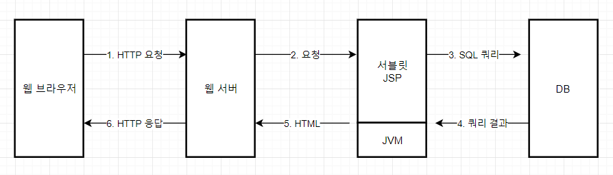

# 프로가 되기 위한 웹기술 입문

[프로가 되기 위한 웹 기술 입문](http://www.kyobobook.co.kr/product/detailViewKor.laf?ejkGb=KOR&mallGb=KOR&barcode=9788992939997&orderClick=LAG&Kc=)

# Ch2. 웹은 어떻게 발전했는가 ?

---

- 웹 서버 - 클라이언트, request - response
    - 서버 : Apache HTTP Server, MS IIS ...
    - 클라이언트 : IE, Chrome, Firefox, Safari ...
- RFC (Request for Comments)
    - 원래는 기술자들이 통신프로토콜이나 규약 등의 초안을 인터넷에 공개하며 의견을 구했기 때문에 '코멘트 모집'의 의미. 현재는 IETF에서 공개하는 기술문서의 형식. 각종 인터넷상의 규격과 규약의 기초

## CGI → Servlet → JSP → (Web Application) Framework

1. CGI (Common Gateway Interface)

    미리 준비된 정적 컨텐츠로는 한계가 있고, 프로그램이 생성한 html 등을 동적 컨텐츠라 한다.

    이 동적 컨텐츠를 생성해 웹 클라이언트에 보내려면, 웹 서버 - 컨텐츠를 생성하는 프로그램간의 연동이 필요하고 그래서 고안된것이 CGI 구조이다.

    CGI에서는, 웹서버가 클라이언트에서 받은 요청을 서버상의 프로그램에 보내고, 프로그램을 요청을 참고해 html을 생성해 웹서버에 돌려준다. 그러면 웹서버는 받은 html을 미리 준비된것처럼 웹 애플리케이션으로 보낸다.

    CGI로 웹이 폭발적으로 보급될 수 있었으며, "CGI=Perl"이라는 오해를 낳을정도로 펄 또는 C가 이용되었다. 

    ⇒ CGI의 문제점

    1. 개발 언어 : 펄은 인터프리터형 언어로 텍스트처리에 강점이 있는데 대규모 애플리케이션 개발에 적합하지 않았으며, 객체지향도 지원하지 않았다.
    2. 성능 : 요청이 올때마다 CGI를 통해 프로세스를 기동하여, 요청이 많아질 경우 따라잡지 못한다.
2. Java/Servlet

    html 등의 웹 컨텐츠를 생성하기 위한 프로그램으로, CGI를 경유해 기동하는 펄이나 C언어의 자바 버전

    서블릿은 객체지향, 쉬운 문법, 멀티 스레드 등 다양한 기능으로 CGI의 문제점을 보완하며 점점 보급되었다.

    서블릿은 기본적으로 개념은 CGI와 같지만, 언어가 자바이며 객체지향을 지원해 대규모 애플리케이션 개발에 적합하며, 웹 컨테이너 내부에서 서블릿을 실행하며 CGI처럼 매번 새로운 프로세스를 기동할 필요없어 비교적 고속으로 작동한다는 이점이 있다.

    - 자바/서블릿과 비슷한 기술로 MS/ASP가 있었다
    - Java/Applet : 당시 웹 브라우저에서 자바 프로그램을 실행할 수 있도록 해, html로는 불가능한 그래픽적 애플리케이션을 구현해주는 기술이 등장했으나, 당시 속도와 성능의 문제로 실패하고 Adobe Flash에 자리를 빼앗겼다.

    ⇒ Servlet의 문제점

    Java안에 HTML코드가 들어가며 프로그램이 길고 복잡해질수록 유지보수가 힘들어지며, 출력될 html이 상상되기 어렵다. 개발자와 웹 디자이너의 협업도 문제가 될 수 있다.

3. Java/JSP

    서블릿이 자바속에 HTML을 넣는다면, 발상의 전환으로 등장한 개념이 HTML속에 자바코드를 넣는 JSP

    HTML에 근접한 형태로 이해하기 쉽고 분업도 쉽다.

    JSP에선 동적으로 출력하고 싶은 부분을 <%와 %>으로 묶고, 이를 Scriptlet이라 한다.

    

    ⇒ (Servlet & JSP 연동해서 사용)

    ⇒ Servlet과 JSP의 문제점

    점점 시스템 규모가 커지고 대규모 애플리케이션을 개발하며, 이 둘로도 쉽지 않게 되었다. 이에 따라 웹 애플리케이션 프레임워크가 필요해진다.

# Ch3. HTTP를 이해하자

---

- URI = URL + URN (URN이 거의 사용되지 않으며, URI = URL처럼 비슷한 의미로 취급되기도 한다)

- HTTP Response

[Response Status code](https://www.notion.so/6c8fe7b935174fec9a6f71a47e566b9f)

[Typical Response Status code](https://www.notion.so/abd176e538b64db9b7ccf4faefbed7be)

- URL에서 index.html과 같은것을 생략해도 접속될 때가 있다. 이것은 웹서버의 기능으로 사용자가 기억하기 편하도록, 파일명을 생략한 URL로 접속시 기본문서파일을 돌려주는 것이다. 웹서버의 설정에 따라 달라지지만, 보통 index.html이나 default.htm 등으로 되어있다.
- 포트번호도 역시 생략되었다면 80번과 같은 지정된 포트로 연결되며 실행됬던 것
- 정보는 Packet단위로 분할되어 송수신되며, 이 패킷의 송수신은 TCP/IP가 책임지고 수행한다

- GET vs POST

    GET방식은 URL속에 매개변수가 포함되므로, 정보가 제3자에게 유출될 수 있다. 또 일반적으로 웹서버에서 request 데이터가 로그에 기록되기 때문에, id나 pw가 로그에 남겨질 수도 있다. 반면에 POST방식은 매개변수가 메시지 본문에 들어간다.

    ⇒ 무조건 POST 방식이 나은게 아니다

    예를 들어, 구글에서 "car"를 검색한 결과를 공유하고 싶다면, 해당 매개변수가 포함된 GET방식의 URL을 공유하면 된다. 또는 이러한 URL을 북마크에 저장할 수도 있다. 즉, RFC2616의 "GET요청에는 부작용이 없을 것으로 기대된다"는 점을 이용할 수 있다. 동시에 이를 위해선, GET 요청의 결과가 시스템의 상태에 영향을 주지 않도록 설계되어야 한다.

    ⇒ 결국, 로그인처럼 기밀정보를 담고 있거나 결제처럼 부작용을 담고있는 처리, 쿼리 문자열에 다 담기 힘든 대량의 정보를 송신해야하는 경우 등은 POST 메서드를 사용해야한다. 반면 이러한 조건에 해당하지 않고 부작용이 없는 경우엔, GET 요청을 이용하는 것이 매개변수째 보존할 수 있는 이점을 활용할 수 있다.

[GET vs Post](https://www.notion.so/1add89b809344af185897f8025960a1f)

# Ch4. CGI에서 웹 애플리케이션으로

---

> Cookie와 Session에 대해 알아본다

피자 주문 사이트 예제에서 아무나 URL을 통해 접근가능하면 문제가 있으므로, 로그인 되어있는지 확인하는 로직이 필요하다.

FTP는 '상태를 가지는' 상태 유지 프로토콜인데 반해, HTTP는 '상태를 갖지않는' 무상태 프로토콜(Stateless Protocol)이다.

그렇다면 무상태인 HTTP에서 어떻게 상태를 표현할 것인가? ⇒ `Cookie` 기술을 이용해 상태를 보존

## Cookie

웹 애플리케이션 ~ 웹 브라우저 사이에서 정보를 교환한다.

기본적으로 웹 서버에서 브라우저로 HTTP 응답 헤더를 이용해 작은 정보를 보낸다. 쿠키를 받은 브라우저는 다음번에 같은 웹 서버에 접속할때, 쿠키를 그대로 HTTP 요청 헤더에 넣어 보낸다.

    // Example : set cookie
    
    // php에선 다음과 같은 함수로 간단히 쿠키 데이터를 설정해 보낼 수 있고
    setcookie("user", $user);
    // HTTP Response 헤더를 보면, 쿠키가 들어있는것을 확인할 수 있다
    Set-Cookie : user=os94

    // Example : delete cookie
    
    // 로그아웃 등의 상황에선 쿠키를 지우도록 설정한다
    setcookie("user", "", time() - 3600); // 쿠키 유효기간을 과거로 설정
    // 응답 헤더에서 deleted 상태 확인 가능
    Set-Cookie : user=deleted; expires= ..생략

⇒ Cookie의 문제점

쿠키를 이용해 웹 브라우저에 상태를 보존할 수 있게 되었다. 하지만 보안상의 문제가 있다.

HTTP 요청/응답 헤더에 데이터가 들어가며, get요청처럼 한눈에 보이진 않지만 fiddler나 burp같은 도구를 이용해 엿볼 수 있다. 브라우저상에서도 보존된 쿠키를 확인할 수 있는 방법이 다양하다. 따라서 id나 pw 등 중요한 정보를 쿠키에 보존하는 것은 보안상 취약하고, 이 때문에 Session이 등장하게 되었다.

## Session

세션의 진행 상황(상태)를 웹 서버측에서 관리한다. DB에 관리표가 들어간 모습을 상상해보자. 웹 서버와 클라이언트는 세션ID만 주고 받는다.

데이터는 서버에 있으므로 노출되지 않고, 쿠키를 타고 SESSION ID만 노출되므로 보안 문제가 해결된다.

다음 링크에서 세션을 이용한 샘플 코드를 볼 수 있다.

[wikibook/webtext](https://github.com/wikibook/webtext/tree/master/pentomino_3)

기본적인 흐름은 다음과 같다.

1. 로그인 성공시 웹서버는 새로운 세션ID를 발행해서 (로그인중인 계정정보를 세션정보에 기록하고) , HTTP 응답 쿠키에 저장해 클라이언트로 보낸다
2. 이후 클라이언트 요청시, 세션ID를 저장한 쿠키를 서버로 보낸다
3. 웹서버는 받은 세션ID를 바탕으로 메모리나 DB상의 상태를 복원한다.

# Ch5. 웹 애플리케이션의 구성 요소

---

실제 시스템에서도 반드시 서버가 물리적으로 한대뿐인것은 아니고 시스템 규모와 특성에 따라 달라진다. 하지만 논리적으로는 1. 웹 서버 2. 애플리케이션 서버 3. DB 서버로 총 세 종류밖에 없다. 이들의 역할에 대해 알아본다.

대표적인 DB 제품들

- Oracle DB
- MS SQL Server
- PostgreSQL
- MySQL

[ JVM을 통한 서블릿/JSP의 실행 ]

JavaVM상에는 Application Server(줄여서 AP서버라 부름)가 작동되고 있으며, 이 AP서버가 서블릿이나 JSP를 작동시키는 구조로 되어 있다.

CGI의 차이점은, CGI는 웹 서버로 요청이 올때마다 새로운 프로세스가 기동되었다가 종료되는 '일회용 모델'이고, AP서버는 항상 프로세스가 실행되고 있으면서 웹 서버로부터 요청을 받아 서블릿/JSP를 실행하는 '재사용 모델'이라는 점이 다르다.

### 웹 서버와 애플리케이션(AP) 서버

[ 웹 서버와 AP 서버의 연동 ]

연동 방법이 표준적으로 정해지지않아 다양한데,

일반적으로 AP 서버측이 주요 웹 서버별로 연동용 모듈을 마련해 그 모듈을 웹 서버에 탑재함으로써 상호 연동을 가능하게 한다.

톰캣의 경우, 아파치용으로 mod_jk라는 연동모듈을 제공하며 이를 아파치 확장기능으로 탑재해 연동한다.

HTML, 이미지 등 정적 컨텐츠만으로 구성된 페이지는 웹 서버상에 배치하고, 동적 컨텐츠인 웹 애플리케이션은 AP 서버가 담당하는 식으로 분담한다.

( [workers.properties](http://workers.properties) & httpd.conf 같은 아파치-톰캣간의 연동 설정 파일 예시 )

⇒ 웹 서버와 AP 서버를 다른 프로세스로 분리하면, AP 서버를 별도의 노드에서 작동시킬 수 있다.

이 둘을 다른 노드에 배치할 경우 시스템 규모가 커지지만, 이런 단점을 메우는 이점이 있다.

일반적으로 AP 서버가 웹 서버보다 작업량이 많다. 반면 웹 서버는 요청 하나하나에 대한 처리량이 적지만, 들어오는 HTTP 요청수가 많다.

*웹 서버와 AP 서버를 다른 노드에 배치하면, 처리량은 가벼운 대신 횟수가 많은 정적 컨텐츠에 대한 요청은 웹 서버, 횟수는 적지만 처리량이 무거운 동적 컨텐츠에 대한 요청은 AP 서버와 같이 적절히 분담시킬 수 있다.*

→ 사실 대부분의 AP 서버는 웹 서버 기능도 갖고 있다.

그렇게 규모가 크지 않은 웹 시스템이라면, AP 서버가 웹 서버로서 최소한의 기능만 제공하긴 하지만, 웹 서버와 연동하지않고 단독으로 작동시켜, 시스템 구성을 단순화시킬 수 있다.

→ AP 서버의 다양한 기능들

- 세션 관리
- 트랜잭션 관리
- DB 접속 관리
- 웹 App.의 관리와 시스템의 가용성, 성능 향상

구성 사례 )

웹 브라우저 - AP 서버 - DBMS (가장 간단한 구성)

웹 브라우저 - 웹 서버 - AP 서버 - DBMS (각 세 서버를 한 노드에서 실행할수도있고, 별개의 노드로 분리할수도있다. 상황에 따라)

# Ch6. 웹 애플리케이션을 효율적으로 개발하는 방법

---

### 포워드 vs 리다이렉트

- Redirect

    서버에서 클라이언트로 302 상태코드를 보내 이동할 곳의 URL을 알려, 클라이언트에서 서버로 다시 HTTP 요청을 발생한다. 즉 HTTP 요청이 2번 발생한다

- Forward

    애플리케이션 서버내에서만 이동처리가 진행된다. 한번의 HTTP 요청으로 이뤄지며, 상대적으로 빠르다는 이점이 있다

### Request Scope (vs Session Scope)

포워드한 곳과 포워드된 곳 사이에서 정보(자바 객체)를 공유하기 위한 방식

이름처럼 HTTP Request 1회 처리 동안만 유효하므로, req가 종료되면 Request Scope에 저장됬던 정보는 사라진다. 따라서 리다이렉트시 정보를 인계할 수 없다.

세션으로도 할수있는 일 아닌가 ? → 세션은 정보를 언제 해제해야할 지 모른다는 점과 메모리 부족 상태에 빠질수도 있는 문제가 있다. (그래서 session timeout 사용)

[Request vs Session Scope](https://www.notion.so/fe8aee47ab8b42fa9c50210e5d6edd35)

### JavaBeans

Java가 인도네시아의 Java coffee에서 유래한 것과 관계되어 beans(콩)의 이름을 갖게 됨

자바 클래스를 부품화하기 위한 것. setter/getter를 가짐

"최근의" 프레임워크는 과김히 세터/게터대신 필드를 public으로 오픈하기도 한다

객체지향의 사실과 오해에서 이 자바빈즈에 대해 부정적으로 언급했던게 기억아는데, 포비 강의때 언급된 내용을 생각하며, 자바빈즈 사용에 주의를 기울여야할 것 같다.

- 레이어 아키텍쳐 : Presentation > Business > Data Access

### (Data Access Layer with) O/R Mapping Framework (ORM)

레이어 패턴으로 시스템을 계층화하고 Data Access Layer를 DAO로 분리하면, DB연결과 관련된 처리를 분리해 전체 코드의 가독성을 향상시킬 수 있다. 하지만 여전히 부족하다! 이를 위해 몇가지 방법이 등장하는데, 그 중 하나가 O/R 매핑 프레임워크이다.

종류 : JPA/Hibernate, MyBatis, iBatis 등..

→ 좀더 세부적으로 분류하면, ORM vs SQL Mapper로 나누는것 같기도함

⇒ 이와 관련된 내용은 분리하여 추후에 별도로 포스팅

# Ch7. 보안관련 - 생략

---